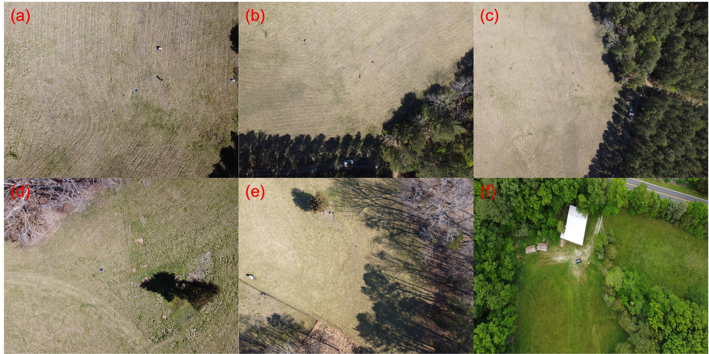
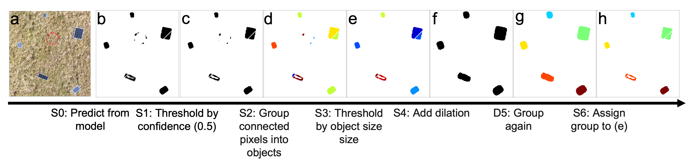
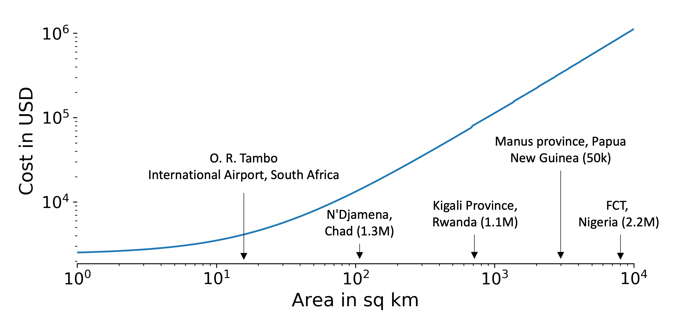
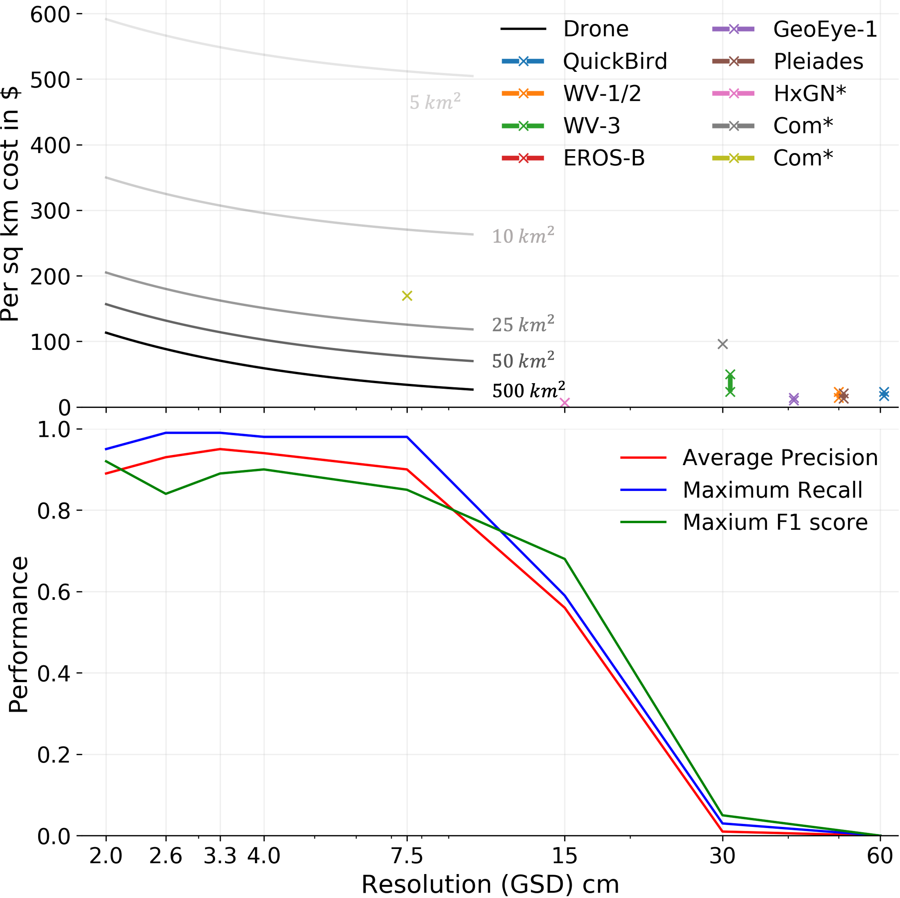
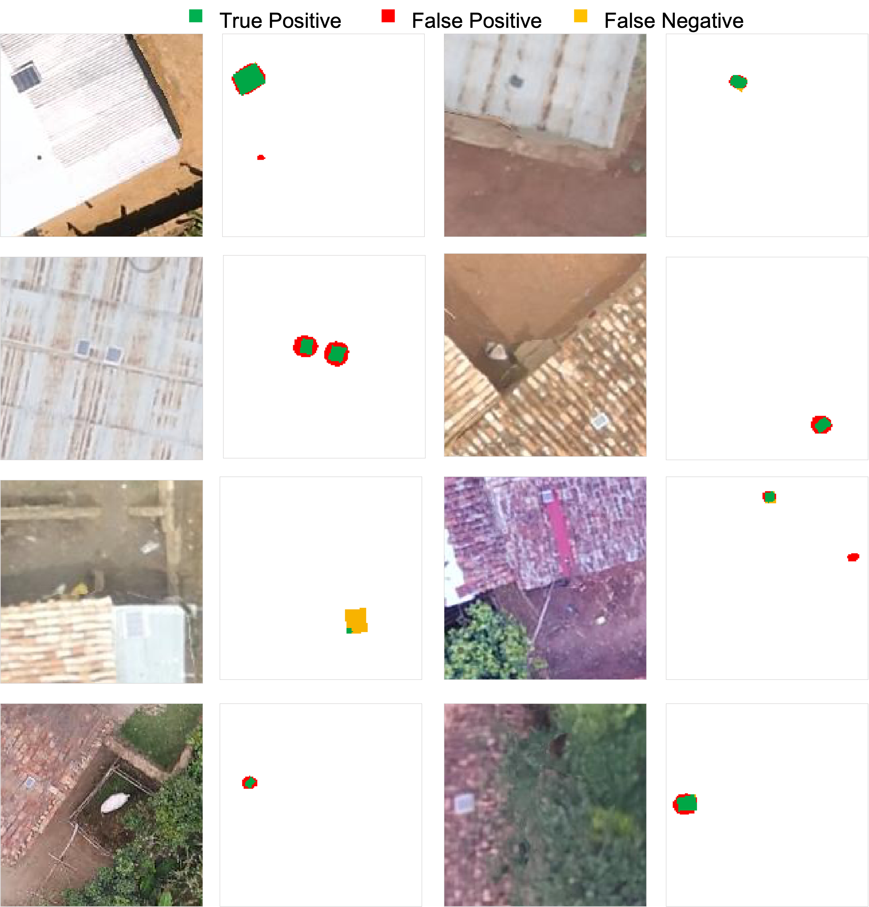

# Utilizing geospatial data for assessing energy security: Mapping small solar home systems using unmanned aerial vehicles and deep learning

This repository is the implementation of [Utilizing geospatial data for assessing energy security: Mapping small solar home systems using unmanned aerial vehicles and deep learning](). Currently submitting, by [Simiao Ren](https://bensonren.github.io/),[Jordan Malof](https://ece.duke.edu/faculty/jordan-malof), [T. Robert Fetter](https://nicholasinstitute.duke.edu/people/t-robert-fetter), [Robert Beach](https://www.rti.org/expert/robert-h-beach), [Jay Rineer](https://www.rti.org/expert/james-rineer) and [Kyle Bradbury](https://energy.duke.edu/about/staff/kyle-bradbury).

This is a repo building up from [MRS framework](https://github.com/bohaohuang/mrs) developed by [Dr. Bohao Huang](https://scholar.google.com/citations?user=TNgWs7oAAAAJ&hl=en&oi=ao). All the major components are directly forked from the MRS framework and this is a application scenario. For guidance on the usage of the framework, please check repo's original [demos](https://github.com/bohaohuang/mrs/tree/master/demo)


## Installation
The list of dependencies is listed in the [env.yml](./environment.yml) file. 

## Flow chart process
Individual steps to reproduce each of the experiments are illustrated in the flow chart below. This is laying the roadmap for how you can recreate the results in our paper. A more detailed explanation can be found below.


## Sample imagery



## Dataset download
### Duke Forest dataset (a.k.a. main dataset, catalyst dataset) download
The main dataset used in this work can be downloaded [here](). Please refer to the README.txt that comes with the dataset for a detailed guideline of the dataset layout. To reproduce the work, only the imgs.zip is needed (for the moving speed experiment, photos are cut from video and included in the imgs.zip file along with annotations). 

### Rwanda drone imagery dataset download (raw)
Follow instruction in the [MLhub website](https://mlhub.earth/data/rti_rwanda_crop_type). You can find the original paper publishing this dataset [here](https://www.mdpi.com/2504-446X/4/1/7).

### Rwanda drone imagery dataset solar PV annotation download
We manually annotated the home solar systems in the Rwanda drone imagery above and you can download the masks [here]().

## Dataset pre-processing
First run the jupyter notebook that comes with the dataset, detailed instructions are given in the notebook. This would prepare for you the dataset needed for all six experiments that we've done (including ones in the appendix). Note that this step only help you setup the images and annotation positions.
```Pre-processing
pre_processing_imgs.ipynb
```

Then, as part of the process to use the MRS framework, one would need to run the dataset pre-processing. Go to [./data](./data) folder and run the MRS framework pre-processor:
```Exp1_preprocessing
python Exp1_preprocessing.py
```

## Model training
The model training is the same as the MRS framework. Simply change the corresponding entries in the [config.json](./config.json) and run below:
```training_code
python train --config config.json
```

### Config.json details
> The positional entries to be changed to user locations:
> | Field name | Usage |
> |:---------------------------------------------:|:------------------------------------------------------------------|
> | data_dir |  The directory containing the patches cut from the Exp1_preprocessing step above. Change it according to the experient you are working on|
 > | train_file |  The training file of the img. This should be highly duplicate with data_dir above and points to file_list_train.txt |
> | valid_file |  The validation file of the img. This should be highly duplicate with data_dir above and points to file_list_valid.txt |
> | finetune_dir |  The pretrained model weights checkpoint file to start from. This should be the pretrained model of satellite imagery for majority of times |
> |save_root| The place to save the trained model weights etc.|

> The hyper-parameters tuned:
> | Field name | Usage |
> |:---------------------------------------------:|:------------------------------------------------------------------|
> | class_weight |**Important Hyper-param:** The class weight added to positive and negative class. The latter is for the positive class.  |
> | loss_weights |The weight added to combine two different loss, the cross entropy loss and the softiou loss. | 
> | learn_rate_encoder | The learning rate of the encoder | 
> | learn_rate_decoder | The learning rate of the decoder | 
> | decay_rate | The decay rate of the learning rate at decay step illustrated next | 
> | decay_step | The step in unit of epoch to decay the learning rate, this is one time decay for each step (not multiples of that) |

> Other hyper-params variable name may lead to confusion :
> | Field name | Usage |
> |:---------------------------------------------:|:------------------------------------------------------------------|
> | mean | The mean of the pretrained dataset (no need to change) | 
> | std | The standard deviation of the pretrained dataset (no need to change) | 
> | num_workers | The number of workers for data fetching |
> | alpha, gamma| The hyper-parameter for optimizer |
> | bp_loss_idx| The index for 'criterion_name' to be included in the back propagation training loss (other remaining ones are only report purpose but no gradient would be passed)|
> | save_epoch | Save the model **Every** X epoch |

## Model selection
There are two ways to choose the model, usually they lead to very similar choice since the metrics are highly correlated. First method is the iou based selection, this is the simpler one as it only need one to look at the tensorboard:
```tensor_board
tensorboard --logdir=../models/
```
> There would be three values recorded for both training and validaiton set: IoU, cross entropy and softIoU. Model selected using this method in this work is selected from validaiton IoU values. Note that these values are pixel-wise average instead of object-wise average.

The other method of choosing the best trained model comes from object wise scores. Since this is highly duplicate with the model inference part below, please refer to the model inference for more details. 
> Models selected using this method in this work is selected from Average Precision of object wise score.

## Inference
Adjust the corresponding fields according to the comments and run:
```infer
python infer.py
```
> Running the command above would generate the confidence map (pixel wise) at SAVE_ROOT specified at the top of the script.
> If you meet error prompt of 'file_list_raw' not found, make use of the script:

```
python make_file_list.py
``` 
## Object-wise post-processing
Since the inference code only output a confidence map, post-processing steps need to take place for converting them into a predicted solar panels and then go through object-wise scorings. The process of post-processing is illustrated in below figure:



This process is built-in in the evaluation step below (where one have the ground truth masks of solar panels), but for application stage inference case where no ground truth masks are presented, one might want to go through the evaluation step without the need to compare with ground truth mask. Run the following script for the post-processing:
```Post_process
python post_processing.py
```

## Evaluation
After we have the confidence map predictions, we would like to generate the Precision-Recall curves from the predictions. 
Adjust the corresponding fields according to the comments and run:
```object_pr
python object_pr.py
```
> Make sure you change the field labeled **!!! Change this !!!** to your own directories.

## Cost estimation for drone operation
Go to [cost estimation](./Exp2_cost_estimation/) for the [jupyter notebook](./Exp2_cost_estimation/) for everything related to the cost estimations.



## Rwanda experiment

Follow the exact same procedure as the Exp 1 but with the Rwanda dataset instead.


## Contributing and issue report 
If you would like to contribute or want to file a bug report, feel free to raise a issue or make a merge request.

## Funding
Support for this work was provided by the [Nicholas Institute for the Environment’s Catalyst program](https://nicholasinstitute.duke.edu/catalyst-program) and from
the [Alfred P. Sloan Foundation](https://sloan.org/) Grant G-2020-13922 through the [Duke University Energy Data Analytics Ph.D. Student Fellowship](https://energy.duke.edu/energy-data-analytics-phd-student-fellows). 

## Credit 

We would like to express special thanks for [Dr. Leslie Collins](https://ece.duke.edu/faculty/leslie-collins) for providing high level feedbacks. We also would like to thank [Dr. Bohao Huang](https://scholar.google.com/citations?user=TNgWs7oAAAAJ&hl=en&oi=ao) for his [MRS framework](https://github.com/bohaohuang/mrs) code, Mr. [Wei (Wayne) Hu](https://energy.duke.edu/leadership-staff/wei-wayne-hu) for his help in developing the code and discussion, [Mr. Trey Gowdy](https://energy.duke.edu/leadership-staff/trey-gowdy) for his helpful discussions and expertise in energy data and other energy fellows / mentors during the [Duke University Energy Data Analytics Ph.D. Student Fellowship Program](https://energy.duke.edu/energy-data-analytics-phd-student-fellows) for their suggestions, questions and comments!

We also thank the [Duke Forest](https://dukeforest.duke.edu/) for their use of the UAV flight zone for data collection!

## License
The project is licensed under the MIT license.

Please cite this work if some of the code or datasets are helpful in your scientific endeavours. For specific datasets, please also cite the respective original source(s), given in the preprint/manuscript.